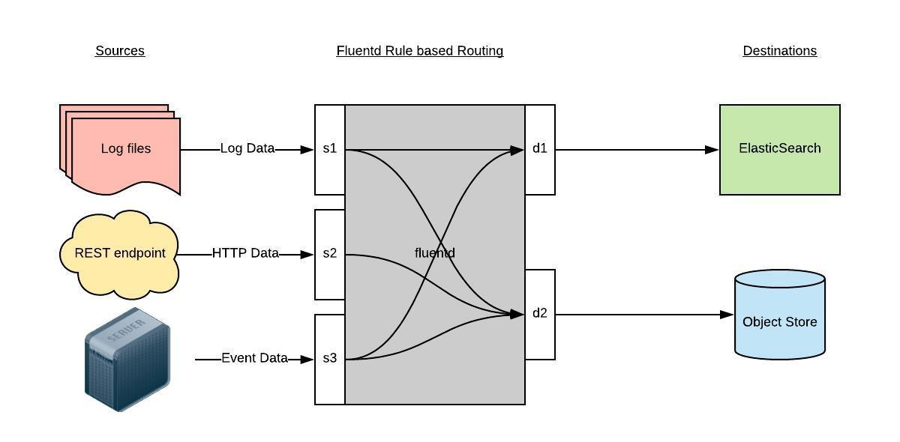

# 日志收集

- [日志收集方案](#日志收集方案)
- [部署efk](#部署efk)
    - [Kubernetes官方部署efk](#Kubernetes官方部署efk)
    - [学习部署EFK](#学习部署EFK)
        - [搭建Elasticsearch](#搭建Elasticsearch)
        - [创建Kibana服务](#创建Kibana服务)
        - [部署Fluentd](#部署Fluentd)
            - [配置](#配置)
            - [安装](#安装)
        - [使用](#使用)
            - [测试使用](#测试使用)

## 日志收集方案

kubernetes集群本身不提供日志收集的解决方案, 一般来说主要有三种方案来做日志收集:
- 在节点上运行一个agent来收集日志
    - 必须在每个节点上运行一个代理程序, 所以直接使用DaemonSet控制器运行该应用程序即可
    - 对应用程序没有任何侵入性.
    - 缺点是该方法仅适合收集输出到stdout和stderr的应用程序日志
    
- 在Pod中包含一个sidecar容器来收集应用日志
    - 用于采集应用程序输出到容器中日志文件的日志信息
        - 方法是, 在Pod中启动另外一个sidecar容器, 将应用程序的日志通过这个容器重新输出到stdout.
        由于重定向输出到了stdout或者stderr, 所以我们可以使用`kubectl logs`来查看日志.
        - 缺点是不仅在原容器文件中占用空间, 也会通过stdout输出后占用磁盘空间
    
- 直接在应用程序中将日志信息推送到采集后端
    - 创建一个单独的日志采集代理程序的sidecar容器, 需要单独配置和应用程序一起运行, 比较灵活. 
    - 缺点是会造成大量的资源消耗(因为有多少个需要采集的pod就需要运行多少个采集代理程序)
    
- 直接从应用程序收集日志: 从代码层面上在应用程序中将日志推送至日志后端
    


## 部署efk  

### Kubernetes官方部署efk
**仅供测试环境下, 生产环境中推荐使用Helm进行部署, [详情](efk2.md#EFK搭建(Helm))
推荐使用[kubernetes efk](https://github.com/kubernetes/kubernetes/tree/release-1.16/cluster/addons/fluentd-elasticsearch)
官方部署
- 这里我们将kubernetes的efk部署yaml文件下载至[yaml2](yaml2)目录下, 测试环境下做了一些修改(并修复了一些bug), 放置在[change](yaml2/change)
目录下
- 并添加了用于elasticsearch持久化所需的storageClass创建文件[es-storageclass.yaml](yaml2/change/es-storageclass.yaml)
- 并修改了[es-statefulset.yaml](yaml2/change/es-statefulset.yaml)和[kibana-service.yaml](yaml2/change/kibana-service.yaml)
- 部署efk
    ```bash
    kubectl apply -f .
    ```


### 学习部署EFK
**仅供参考**

Kubernetes中比较流行的日志收集解决方案是Elasticsearch、Fluentd、Kibana(EFK)技术栈.
- [Elasticsearch](../../../elastic%20search/prepare.md)详情
- [Fluentd](../../../fluentd/prepare.md)详情
- [Kibana](../../../kibana/prepare.md)详情

创建Elasticssearch集群之前, 我们先创建一个命名空间`logging`(用以创建所有日志相关的资源对象), 
[kube-logging.yaml](yaml/kube-logging.yaml)

搭建集群步骤如下

#### 搭建Elasticsearch
- 搭建Elasticsearch集群, [elasticsearch-svc.yaml](yaml/elasticsearch-svc.yaml)搭建三个节点的集群, 
防止高可用集群中可能出现的"脑裂"问题
    ```bash
    kubectl create -f elasticsearch-svc.yaml
    ```
    我们已经为Pod设置了无头服务和一个稳定的域名`.elasticsearch.logging.svc.cluster.local`
- 创建StorageClass对象用以创建动态PV挂载pod数据至目录, [elasticsearch-storageclass.yaml](yaml/elasticsearch-storageclass.yaml)
    ```bash
    kubectl create -f elasticsearch-storageclass.yaml
    ```
- 通过StatefulSet创建具体的Elasticsearch的Pod应用, [elasticsearch-statefulset.yaml](yaml/elasticsearch-statefulset.yaml).
    - 使用StatefulSet部署的原因: Elasticsearch需要稳定的存储来保证Pod重新调度或者重启后的数据依然保持不变.
    ```bash
    kubectl create -f elasticsearch-statefulset.yaml
    # 查看部署情况
      kubectl get sts -n logging
      # 将本地端口转发至Elasticsearch节点对应端口
      # kubectl port-forward es-cluster-0 9200:9200 --namespace=logging
      # 测试Elasticsearch是否可用
      # curl http://localhost:9200/_cluster/state?pretty
    ```
    

#### 创建Kibana服务
- 定义Kibana的service和Deployment, [kibana.yaml](yaml/kibana.yaml)
    ```bash
    kubectl create -f kibana.yaml
    ```
部署成功后, 可使用`http://<任意节点IP>:nodeport`访问Kibana服务.


#### 部署Fluentd
[官方k8s部署方案](https://docs.fluentd.org/container-deployment/kubernetes)

Fluentd是一个高效的日志聚合器, 使用Ruby编写, 拥有足够的高效且消耗的资源相对较少的特点.

工作原理: Fluentd通过一组给定的数据源抓取日志数据, 处理后(转换成结构化的数据格式)将它们转发给其他
服务, 比如Elasticssearch、对象存储等. 支持超过300个日志存储和分析服务. 主要运行步骤如下:
- 首先Fluentd从多个日志源获取数据
- 结构化并标记这些数据
- 然后根据匹配的标签将数据发送到多个目标服务去
    
    
##### 配置
一般来说我们是通过一个配置文件来告诉Fluentd如何采集、处理数据的.
- 日志源配置(收集kubernetes节点上的所有容器日志), 详情请见
[fluentd-configmap.yaml](yaml/fluentd-configmap.yaml)中的`containers.input.conf`
- 路由配置, 详情请见[fluentd-configmap.yaml](yaml/fluentd-configmap.yaml)中的`output.conf`

##### 安装

- 创建[fluentd-configmap.yaml](yaml/fluentd-configmap.yaml), 其中配置了docker容器日志目录
- [fluentd-daemonset.yaml](yaml/fluentd-daemonset.yaml)


#### 使用

- Fluentd启动成功后, 前往Kibana的Dashboard页面中点击左侧的`Discover`
    - 在输入框中输入`logstash-*`即可匹配到Elasticsearch集群中的所有日志, 然后点击下一步进入以下页面
        
    - 下拉选择`@timestamp`字段再点击`create index pattern`创建索引模式
        
- 设置完成后, 我们即可通过Kibana的Dashboard的Discover查看我们最近收集的日志数据了
       
 
至此, 我们已经成功部署了EFK日志集群了. 使用详情请参考Elasticsearch、Kibana、Fluent的相应文档.


##### 测试使用

模拟我们的应用将日志信息打印到stdout, 这样fluentd通过收集容器的日志即可收集到我们应用的日志了.
[testcount.yaml](yaml/testcount.yaml)
```bash
kubectl create testcount.yaml
```
