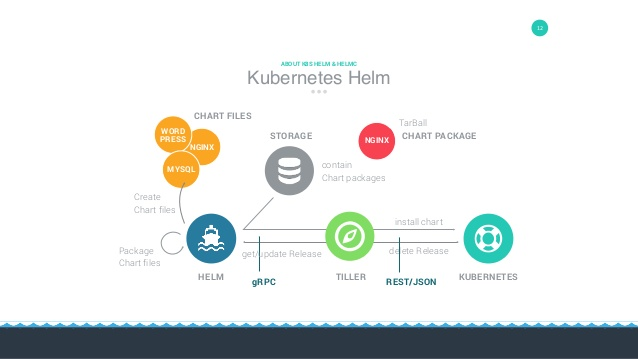

# Helm使用

Helm是kubernetes的一个包管理工具, 它具有如下功能额:
- 创建新的chart
- chart打包成tgz格式
- 上传chart到chart仓库或从仓库中下载chart
- 在`kubernetes`集群中安装或卸载chart
- 管理用`Helm`安装的chart的发布周期

Helm有三个重要概念:
- chart: 包含了创建`kubernetes`的一个应用实例的必要信息
- config: 包含了应用发布配置信息
- release: 是一个chart及其配置的一个运行实例

## Helm使用教程
- [Helm的基本使用](helm%20base.md): 包含Chart私有仓库的创建

## Helm组件
Helm主要有以下两个组成部分:

-  `Helm Client`: 是用户命令行工具, 负责以下工作
    - 本地chart开发
    - 仓库管理
    - 与Tiller server交互
    - 发送预安装的chart
    - 查询release信息
    - 要求升级或卸载已存在的release
- `Tiller Server`: 是一个部署在`kubernetes`集群内部的server, 其与Helm client、 Kubernetes API server
进行交互, 负责以下工作
    - 监听来自Helm client的请求
    - 通过chart及其配置构建一次发布
    - 安装chart到Kubernetes集群, 并跟踪随后的发布
    - 通过与Kubernetes交互升级或卸载chart
简单的说, client管理charts, 而server管理发布release

## 安装
- 在[Helm Release](https://github.com/helm/helm/releases)下载二进制文件, 解压后将执行文件`helm`拷贝到
`/usr/local/bin`目录下即可.
    ```bash
    # 在安装Helm的机器上查看版本号
    helm version
    ```

- `helm init`初始化
    ```bash
    helm init
    # 执行helm init 命令初始化(由于Helm默认去gcr.io拉取镜像, 应使用以下命令代替gcr.io源)
    # helm init --upgrade --tiller-image cnych/tiller:v2.14.3
    # 如果卡住或者报google api之类的错误, 可使用下面的命令进行初始化
    # helm init --upgrade --tiller-image cnych/tiller:v2.14.3 --stable-repo-url https://cnych.github.io/kube-charts-mirror/
    # Helm 服务端正常安装后, tiller默认被部署在k8s的kube-system命名空间下
    kubectl get pod -n kube-system -l app=helm
    ```

- 为Helm创建serviceAccount, 赋予可执行权限, [rbac.yaml](rbac.yaml)
    ```bash
    kubectl create -f rbac.yaml
    ```
    - 创建serviceAccount之后还需要给Tiller打上一个补丁
    ```bash
    kubectl patch deploy --namespace kube-system tiller-deploy -p '{"spec":{"template":{"spec":{"serviceAccount":"tiller"}}}}'
    ```
    
    
## 使用

- 尝试创建一个Chart, 会生成一个名为`hello-helm`的chart文件夹, 
文件具体作用请参考[官方文档](https://helm.sh/docs/developing_charts/#charts)
    ```bash
    # 创建的hello-helm的Chart包含了kubernetes一个应用示例的必要信息
    helm create hello-helm
    tree hello-helm
    ```
    
    - NOTES.txt: chart 的 "帮助文本".这会在用户运行 helm install 时显示给用户.
    - deployment.yaml:创建 Kubernetes deployment 的基本 manifest
    - service.yaml:为 deployment 创建 service 的基本 manifest
    - ingress.yaml: 创建 ingress 对象的资源清单文件
    - _helpers.tpl:放置模板助手的地方,可以在整个 chart 中重复使用
- 安装该Chart
    - 安装示例hello-helm
    ```bash
    helm install ./hello-helm
    ```
    
    - 查看pods启动情况
    ```bash
    kubectl get pods -l app.kubernetes.io/name=hello-helm
    kubectl get svc -l app.kubernetes.io/name=hello-helm
    ```
    至此, 一个helm工具包使用的示例教程就弄完成了
    
    
### helm 常用命令
```bash
# 查看helm部署的release
helm list
# 打包chart,即可将打包后的tgz文件分发到任意的服务器上面, 通过helm fetch即可获取到该chart
helm package hello-helm
# 删除一个release
helm delete unrealized-hamster
```


## Helm Hub
[Helm Hub](https://hub.helm.sh/)是Helm官方的网站, 里面包含了大量的Helm Chart. 可以方便我们部署服务

添加Helm Hub源
```bash
# kubernetes官方源
helm repo add stable https://kubernetes-charts-incubator.storage.googleapis.com/
# 阿里源https://github.com/cloudnativeapp/charts
helm repo add apphub https://apphub.aliyuncs.com
```