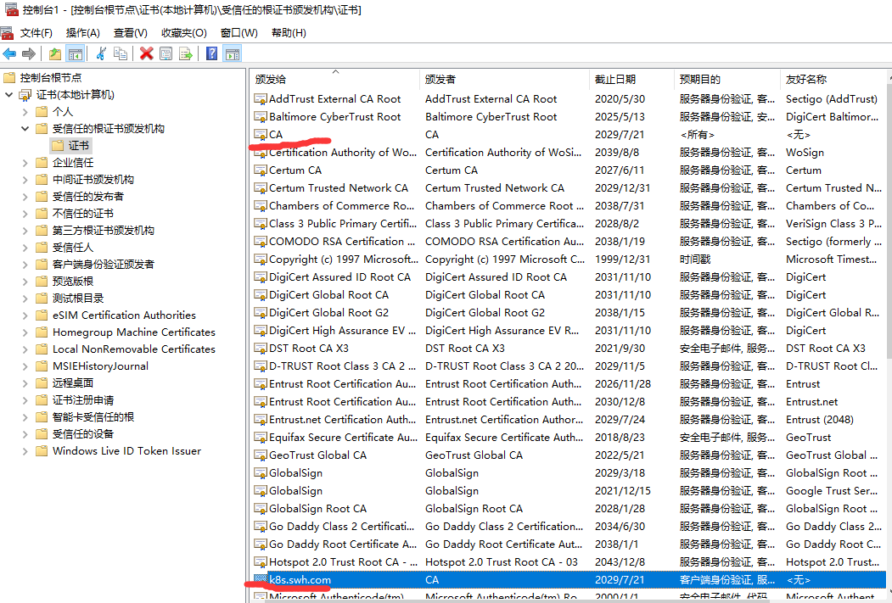

# Dashboard插件

注意: 由于Dashboard只允许本地使用HTTP连接进行访问, 其它地址只允许使用HTTPS访问. 因此这里kubectl proxy暴露外网访问需要
配合HTTPS方式访问. 而外网访问则涉及到证书等问题.参照官方文档[创建证书](https://github.com/kubernetes/dashboard/wiki/Certificate-management)

## NOTE
- Kubeconfig Authentication 不支持外部提供的身份认证及基于证书的认证方法.
- Dashboard can only be accessed over HTTPS
- `Heapster` has to be running in the cluster for the metrics and graphs to be available. 
Read more about it in Integrations guide.


## 创建证书
- 生成证书([博客参考](https://blog.csdn.net/chenleiking/article/details/81488028))
    - 创建自签名CA
    ```bash
    # 生成私钥
    openssl genrsa -out ca.key 2048
    # 生成自签名证书
    openssl req -new -x509 -key ca.key -out ca.crt -days 3650 -subj "/C=CN/ST=HB/L=WH/O=DM/OU=YPT/CN=CA"
    ```
    - 签发Dashboard证书, 先配置文件[dashboard.cnf](dashboard.cnf)
    ```bash
    # 生成私钥
    openssl genrsa -out dashboard.key 2048
    # 申请签名请求
    openssl req -new -sha256 -key dashboard.key -out dashboard.csr -subj "/C=CN/ST=HB/L=WH/O=DM/OU=YPT/CN=k8s.swh.com"
    # 签发证书
    openssl x509 -req -sha256 -days 3650 -in dashboard.csr -out dashboard.crt -CA ca.crt -CAkey ca.key -CAcreateserial -extfile dashboard.cnf
    ```
    - 创建dashboard secret
    ```bash
    #kubectl create secret generic kubernetes-dashboard-certs --from-file="$YourPath/dashboard.crt,$YourPath/dashboard.key" -n kube-system 
    kubectl create secret generic kubernetes-dashboard-certs --from-file="/root/certs/dashboard.crt,/root/certs/dashboard.key" -n kube-system
    # 查看dashboard secret内容
    kubectl get secret kubernetes-dashboard-certs -n kube-system -o yaml
    ```
    - 在访问所使用的机器上(我的是windows), 添加生成的CA证书. 具体可参考[windows下添加证书](https://jingyan.baidu.com/article/e4511cf35b47fa2b855eaf5d.html)
    
    
- ~~不采用: 生成证书([官方方式](https://github.com/kubernetes/dashboard/wiki/Certificate-management#self-signed-certificate))~~

接下来就可进行安装dashboard插件的操作了


## 安装Dashboard插件
- 获取kubernetes-dashboard.yaml文件
    ```bash
    wget https://raw.githubusercontent.com/kubernetes/dashboard/v1.10.1/src/deploy/recommended/kubernetes-dashboard.yaml
    ```
- 更改`kubernetes-dashboard.yaml`文件, 改成[kubernetes-dashboard.yaml](../../../../doc/k8s/plugins/dashboard/kubernetes-dashboard.yaml)
    - 将yaml文件中的镜像源 `k8s.gcr.io/kubernetes-dashboard-amd64:v1.10.1` 改为 `mirrorgooglecontainers/kubernetes-dashboard-amd64:v1.10.1`, 
        
    - 在spec中添加一行 `type: NodePort` 将服务改为NodePort
        
    - 权限管理: 将`kubernetes-dashboard.yaml`中的权限验证更改成clusterRole
        - 修改前
            ```yaml
                ---
                # ------------------- Dashboard Service Account ------------------- #
                
                apiVersion: v1
                kind: ServiceAccount
                metadata:
                  labels:
                    k8s-app: kubernetes-dashboard
                  name: kubernetes-dashboard
                  namespace: kube-system
                
                ---
                # ------------------- Dashboard Role & Role Binding ------------------- #
                
                kind: Role
                apiVersion: rbac.authorization.k8s.io/v1
                metadata:
                  name: kubernetes-dashboard-minimal
                  namespace: kube-system
                rules:
                  # Allow Dashboard to create 'kubernetes-dashboard-key-holder' secret.
                - apiGroups: [""]
                  resources: ["secrets"]
                  verbs: ["create"]
                  # Allow Dashboard to create 'kubernetes-dashboard-settings' config map.
                - apiGroups: [""]
                  resources: ["configmaps"]
                  verbs: ["create"]
                  # Allow Dashboard to get, update and delete Dashboard exclusive secrets.
                - apiGroups: [""]
                  resources: ["secrets"]
                  resourceNames: ["kubernetes-dashboard-key-holder", "kubernetes-dashboard-certs"]
                  verbs: ["get", "update", "delete"]
                  # Allow Dashboard to get and update 'kubernetes-dashboard-settings' config map.
                - apiGroups: [""]
                  resources: ["configmaps"]
                  resourceNames: ["kubernetes-dashboard-settings"]
                  verbs: ["get", "update"]
                  # Allow Dashboard to get metrics from heapster.
                - apiGroups: [""]
                  resources: ["services"]
                  resourceNames: ["heapster"]
                  verbs: ["proxy"]
                - apiGroups: [""]
                  resources: ["services/proxy"]
                  resourceNames: ["heapster", "http:heapster:", "https:heapster:"]
                  verbs: ["get"]
                
                ---
                apiVersion: rbac.authorization.k8s.io/v1
                kind: RoleBinding
                metadata:
                  name: kubernetes-dashboard-minimal
                  namespace: kube-system
                roleRef:
                  apiGroup: rbac.authorization.k8s.io
                  kind: Role
                  name: kubernetes-dashboard-minimal
                subjects:
                - kind: ServiceAccount
                  name: kubernetes-dashboard
                  namespace: kube-system
            ```
        - 修改后
            ```yaml
                ---
                
                apiVersion: v1
                kind: ServiceAccount
                metadata:
                  name: kubernetes-dashboard
                  namespace: kube-system
                
                ---
                
                kind: ClusterRoleBinding
                apiVersion: rbac.authorization.k8s.io/v1
                metadata:
                  name: kubernetes-dashboard
                subjects:
                  - kind: ServiceAccount
                    name: kubernetes-dashboard
                    namespace: kube-system
                roleRef:
                  kind: ClusterRole
                  name: cluster-admin
                  apiGroup: rbac.authorization.k8s.io
            ```
- 创建dashboard service
    ```bash
    kubectl apply -f kubernetes-dashboard.yaml 
    # 使用命令查看服务监听端口等信息
    kubectl get svc kubernetes-dashboard -n kube-system
    # 创建一个安全通道, 以便能从外网访问到集群中的Dashboard服务
    # kubectl proxy --address='0.0.0.0'  --accept-hosts='^*$'
    ```
    - 访问`https://192.168.80.135:32710`后可见页面, 使用令牌后即可登录dashboard管理界面.
        - 根据`kubernetes-dashboard.yaml`中的dashboard service account获取token以访问服务
            ```bash
            # 查看kubernetes-dashboard的token信息
            kubectl get secret -n kube-system|grep kubernetes-dashboard-token
            # 获取指定token信息
            kubectl get secret kubernetes-dashboard-token-fj68w -o jsonpath={.data.token} -n kube-system |base64 -d
            ```
            
        - 访问成功后, 即可见
        

## 参考
- [k8sUI管理](https://www.cnblogs.com/itrena/p/8994764.html)
- [kubernetes dashboard通过Ingress提供HTTPS访问](https://my.oschina.net/u/2306127/blog/1930169?from=timeline)

token 
```bash
eyJhbGciOiJSUzI1NiIsImtpZCI6IiJ9.eyJpc3MiOiJrdWJlcm5ldGVzL3NlcnZpY2VhY2NvdW50Iiwia3ViZXJuZXRlcy5pby9zZXJ2aWNlYWNjb3VudC9uYW1lc3BhY2UiOiJrdWJlLXN5c3RlbSIsImt1YmVybmV0ZXMuaW8vc2VydmljZWFjY291bnQvc2VjcmV0Lm5hbWUiOiJrdWJlcm5ldGVzLWRhc2hib2FyZC10b2tlbi1majY4dyIsImt1YmVybmV0ZXMuaW8vc2VydmljZWFjY291bnQvc2VydmljZS1hY2NvdW50Lm5hbWUiOiJrdWJlcm5ldGVzLWRhc2hib2FyZCIsImt1YmVybmV0ZXMuaW8vc2VydmljZWFjY291bnQvc2VydmljZS1hY2NvdW50LnVpZCI6ImQxMjFlN2ExLWQxMmYtNDAzYy1hYWVhLWExYzIwMWJjMDM3ZSIsInN1YiI6InN5c3RlbTpzZXJ2aWNlYWNjb3VudDprdWJlLXN5c3RlbTprdWJlcm5ldGVzLWRhc2hib2FyZCJ9.KM9VBfv2s_0YNVcHcn6nsGXxlDsecjWjPiVmsEZTOsSnCgSMyus1S0ZAVDoOQbp5i1xAOK4T6zPf6HL5QJx78ofHxz_vLzFu3Nq6Ol0i_WKY1O52tRGn75_yZ1eIWJ4CzjhmLiBO9TmC74z1DaeTbIbEZpDuSoyWXofNPViJSd-i30WZjgBjgxDw6L_VxmcMwTFwXZlOlJfDHSzSzmW6OZM8V7iZcjvT17tajoV09MihI2XWle3j7A6yKDw-PjvARFfpaVBeQsxWVhfCJWdw8K60x_FU2Wyi3zKIm6Kiefjg8Cy_-38CXKTt0_PL-2KpeXje-mqP1AKg5cyyM1kQQg
```