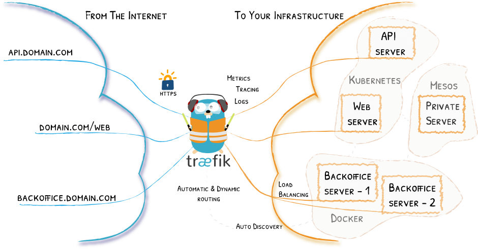

# ingress插件

K8s集群内部使用`kube-dns`或`core-dns`实现服务发现的功能, K8s中将集群中的应用暴露给外部用户除了`NodePort`和
`LoadBlancer`的方式之外, K8s提供了`ingress`这个资源对象.

其本质就是从kubernetes集群外部访问集群的一个入口, 将外部的请求转发到集群内不同的Service上, 相当于nginx、haproxy
等负载均衡代理服务器. 只不过不需要像Nginx那样手动更改Nginx配置, 而是由Ingress 通过不断与kube-apiserver打交道, 
实时感知后端service、pod的变化.


## 插件列表
- [traefik](https://traefik.io/)
- [nginx-controller](https://kubernetes.github.io/ingress-nginx/)
- [Kubernetes Ingress Controller for Kong](https://konghq.com/blog/kubernetes-ingress-controller-for-kong/)
- [HAProxy Ingress controller](https://github.com/jcmoraisjr/haproxy-ingress)

目前常用较多的是`traefik`和`nginx-controller`, 前者性能较后者差, 但配置相对会比较简单.

## Traefik介绍

Traefik是一款开源的反向代理与负载均衡工具. 它最大的优点是能够与常见的微服务系统直接整合, 可以实现自动化动态配置.


### 部署

- 使用RBAC安全认证方式[`rbac.yaml`](rbac.yaml)
    ```bash
    kubectl apply -f rbac.yaml
    ```
- 部署traefik, 部署文件[`traefik.yaml`](traefik.yaml)
    ```bash
    kubectl apply -f traefik.yaml
    # 查看部署情况(包括端口)
    kubectl get svc traefik-ingress-service -n kube-system
    ```
    - 现在通过`http://192.168.80.137:32575`(调度部署所在的节点)即可访问到Traefik的Dashboard了.
    
    
### Ingress对象
经过上述步骤, 我们暂时是通过NodePort来访问traefik的Dashboard的, 接下来我们来学习如何通过ingress访问.
- 首先, 建立一个ingress对象: ([ingress.yaml](ingress.yaml))
    ```bash
    # 为traefik dashboard创建对应的ingress对象
    kubectl create -f ingress.yaml
    ```
    - ~~~`此步骤可不进行`由于ingress必须使用域名, 不支持ip地址, 因此我们需要在虚拟机下`/etc/hosts`中添加一行~~~
    ```bash
    # 自定义域名(仅实验)
    192.168.80.137  k8s.swh.node.com
    ```
    - 同时用于访问的物理机也需配置该域名解析, 否则在物理机上访问会失败, 在本机windows下
    `C:\Windows\System32\drivers\etc`添加
    ```bash
    192.168.80.137  k8s.swh.node.com
    192.168.80.135 k8s.swh.com
    ```
- 测试连接, 通过`http://k8s.swh.com:32404`来访问traefik的Dashboard服务.
    - 因为`traefik`服务是使用nodePort方式部署在`k8s.swh.node.com`上的, 正常我们只能通过该节点上的
    `Ip` + `port`进行访问, 通过ingress的方式则可以将service暴露在其他节点上.

结果示例:


### Ingress tls和path

现在大部分场景下我们都会使用https来访问我们的服务, 接下来将使用自签名的证书用于https访问.
- 使用openssl命令生成CA证书:
```bash
# 生成CA证书
openssl req -newkey rsa:2048 -nodes -keyout tls.key -x509 -days 365 -out tls.crt
# 创建secret对象存储上面的证书
kubectl create secret generic traefik-cert --from-file=tls.crt --from-file=tls.key -n kube-system
```
- 更改Traefik的默认配置, 让其支持https:
[详情请参考](https://www.qikqiak.com/k8s-book/docs/41.ingress%20config.html)
