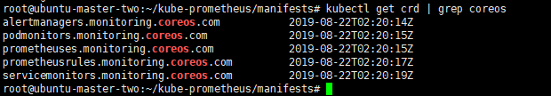

# Operator

@TOC
- [架构](#架构)
- [安装](#安装)
- [数据持久化](#数据持久化)
- [使用](#使用)
    - [完善prometheus监控配置](#完善prometheus监控配置)
    - [配置grafana](#配置grafana)


`Operator`是基于Kubernetes的资源和控制器概念之上构建, 但同时又包含了应用程序特定的一些专业知识.
- 资源: 对象的状态定义
- 控制器: 观测、分析和行动, 以调节资源的分布 

## 架构


`Operator`作为控制器, 它会去创建`Prometheus`、`ServiceMonitor`、`AlertManager`、`PrometheusRule`4个
`CRD`资源对象, 然后一直监控并维持这4个资源对象的状态. 其中
    - `Prometheus`作为`Prometheus Server`存在
    - `ServiceMonitor`就是`exporter`的各种抽象, `exporter`是用来专门提供`metrics`数据接口的工具, `Prometheus`
    就是通过`ServiceMonitor`提供的`metrics`数据接口去pull数据的
    - `AlertManager`对应`AlertManager`的抽象
    - `PrometheusRule`则是`Prometheu`实例报警使用的规则文件
这样在集群中监控什么数据, 就变成了直接去操作Kubernetes集群的资源对象, 如上图中
    - 一个ServiceMonitor可以通过labelSelect的方式去匹配一类Service
    - Prometheus也可以通过labelSelector去匹配多个ServiceMonitor


## 安装

- clone `Prometheus`源码, 本地保存的[manifests](manifests) yaml文件目录
    ```bash
    git clone https://github.com/coreos/kube-prometheus.git
    cd kube-prometheus/manifests/
    # 使用ls查看manifests下有哪些yaml文件
    ls
    ```
- 需要修改的地方
    - 修改[prometheus-clusterRole.yaml](manifests/prometheus-clusterRole.yaml), 修改权限, 以供后续使用
    - 修改[grafana-deployment.yaml](manifests/grafana-deployment.yaml), 配置grafana的Dashboard管理用户和密码\
        - 
            ```yaml
                env:
                # 配置grafana的管理员用户和密码
                - name: GF_SECURITY_ADMIN_USER
                  value: admin
                - name: GF_SECURITY_ADMIN_PASSWORD
                  value: adminkw123
            ```
        -  因为EmptyDir的生命周期与pod一致, pod宕掉会影响我们在grafana上做的配置, 
        持久化grafana的数据(使用StorageClass):
            - 创建grafana的storageClass[grafana-storageClass.yaml](manifests/grafana-storageClass.yaml)
                ```bash
                kubectl create -f grafana-storageClass.yaml
                ```
            - 创建grafana PVC对象[grafana-pvc.yaml](manifests/grafana-pvc.yaml)
                ```bash
                kubectl apply -f grafana-pvc.yaml
                ```
            - 修改[grafana-deployment.yaml](manifests/grafana-deployment.yaml)
                ```yaml
                # 第一处需要修改的地方
                  securityContext:
                #        runAsNonRoot: true
                #        runAsUser: 65534
                    fsGroup: 472
                    runAsUser: 472
      
                # 第二处需要修改的地方
                  volumes:
                  #- emptyDir: {}
                  #  name: grafana-storage
                  # 将grafana-storage替换成PVC进行持久化存储
                  - name: grafana-storage
                    persistentVolumeClaim:
                      claimName: grafana-storage
                ```
    - ~~修改[prometheus-prometheus.yaml](manifests/prometheus-prometheus.yaml)、
    [alertmanager-alertmanager.yaml](manifests/alertmanager-alertmanager.yaml)中`replicas`改为1(生产环境中不建议, 
    只是因为我本地只运行一个work node节点限制了而已)~~
    
- 通过`Prometheus Operator`部署`Prometheus`、`grafana`等
    - # 由于官方yaml中的某些镜像需要翻墙下载, 可根据自身情况: 
        - 1. 使用vpn等翻墙软件  
        - 2. 将镜像源更改为国内源
    ```bash
    kubectl create -f manifests/
    ```
- 部署完成后
    - Operator会自动创建以下CRD资源对象(k8s自定义资源对象)
        ```bash
        kubectl get crd | grep coreos
        ```
        
    - Operator会创建名为`monitoring`的namespaces
        ```bash
        # 查看部署的pod
        kubectl get pod -n monitoring
        # 查看部署的service
        kubectl get svc -n monitoring
        ```
        
从这里看, 我们grafana、prometheus-k8s的service类型为clusterIP, 如果需要设置外网访问, 则需要更使用nodePort或者
ingress
- nodePort方式
    - 修改[grafana-service.yaml](manifests/grafana-service.yaml)
        ```yaml
        apiVersion: v1
        kind: Service
        metadata:
          labels:
            app: grafana
          name: grafana
          namespace: monitoring
        spec:
          type: NodePort
          ports:
          - name: http
            port: 3000
            targetPort: http
          selector:
            app: grafana
        ```
    - 修改[prometheus-service.yaml](manifests/prometheus-service.yaml), **生产环境中可不使用NodePort暴露到外网**
        ```yaml
        apiVersion: v1
        kind: Service
        metadata:
          labels:
            prometheus: k8s
          name: prometheus-k8s
          namespace: monitoring
        spec:
          type: NodePort
          ports:
          - name: web
            port: 9090
            targetPort: web
          selector:
            app: prometheus
            prometheus: k8s
          sessionAffinity: ClientIP
        ```
- ingress代理方式
    - 在[manifests](manifests)目录下创建[grafana-ingress.yaml](manifests/grafana-ingress.yaml)文件
    - 在[manifests](manifests)目录下创建[prometheus-ingress.yaml](manifests/prometheus-ingress.yaml)文件, 
    **生产环境中不建议, 建议统一使用grafana外接prometheus**
    ```bash
    kubectl apply -f manifests/
    ```

## 数据持久化
由于`prometheus`是通过emptyDir进行挂载的, 而emptyDir挂载的数据的生命周期与Pod一致, 当Pod宕掉的时候, 数据
也就丢失了. 因此需要配置数据持久化. 通过`StorageClass`做数据持久化
- 首先, 创建StorageClass对象[prometheus-storageclass.yaml](manifests/prometheus-storageclass.yaml)
    ```bash
    kubectl create -f prometheus-storageclass.yaml
    ```
- 然后在Prometheus的CRD资源对象中添加storageClass配置, [prometheus-prometheus.yaml](manifests/prometheus-prometheus.yaml)
   ```yaml
   storage:
      volumeClaimTemplate:
        spec:
          storageClassName: prometheus-data-db
          resources:
            requests:
              storage: 10Gi
   ```
    ```bash
    kubectl apply -f prometheus-prometheus.yaml
    ```
    
    
    
## 使用

### 完善prometheus监控配置

访问Prometheus的Dashboard, 大部分的监控配置都运行正常, 只有几个没有管理到对应的监控目标.
比如: kube-controller-manager和kube-scheduler这两个系统组件. 这是因为我们虽然定义了
`ServiceMonitor`资源, 但是并没有与之对应的Service, 因此需要我们创建相应的service

- [prometheus-serviceMonitorKubeScheduler.yaml](manifests/prometheus-serviceMonitorKubeScheduler.yaml)对应
的service创建[prometheus-kubeSchedulerService.yaml](manifests/prometheus-kubeSchedulerService.yaml)
    ```bash
    kubectl create -f prometheus-kubeSchedulerService.yaml
    ```
- [prometheus-serviceMonitorKubeControllerManager.yaml](manifests/prometheus-serviceMonitorKubeControllerManager.yaml)
对应的service创建[prometheus-kubeControllerManagerService.yaml.yaml](manifests/prometheus-kubeControllerManagerService.yaml.yaml)


### 配置grafana

[参考](../../grafana/Grafana.md)做如下操作
- 添加prometheus的dashboard
- 添加kubernetes插件


~~修改[prometheus-serviceMonitorKubelet.yaml](manifests/prometheus-serviceMonitorKubelet.yaml)文件, 
将`https-metrics`改为`http-metrics`, 这是由于这个ServiceMonitor之前是关联kubelet的10250端口去采集节点数据, 
而现在为了安全, 这个metrics数据已经迁移到10255这个只读端口上去了~~