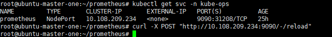
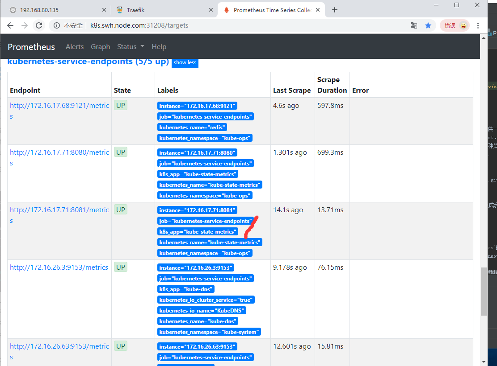

# prometheus使用说明文档

[**!!!监控最终部署方式**](#监控最终部署方式)


下面的文档是为了帮助你快速上手configmap的方式动态添加监控信息等
- [监控kubernetes集群应用](#监控kubernetes集群应用)
- [监控kubernetes集群节点](#监控kubernetes集群节点)
- [监控kubernetes常用资源对象](#监控kubernetes常用资源对象)
    - [容器监控](#容器监控)
    - [监控apiserver](#监控apiserver)
    - [kube-state-metrics](#kube-state-metrics)


## 监控kubernetes集群应用

Prometheus的数据指标是通过一个公开的HTTP(S)数据接口获取到的, 我们不需要单独安装监控的agent, 只需要暴露一个metrics接口, 
prometheus就会定期去拉取数据.

而现在很多服务(比如kubernetes的各个组件)都内置了一个/metrics接口

### 监控普通应用(自带/metrics的应用)

以`Traefik`为例:
- 在[traefik.toml](../../ingress/traefik.toml)配置文件中添加以下配置开启`metrics`
    ```bash
    [metrics]
      [metrics.prometheus]
        entryPoint = "traefik"
        buckets = [0.1, 0.3, 1.2, 5.0]
    ```
    查看是否开启成功
    
- 将这个`/metrics`接口配置到[`prometheus-cm.yaml`](../prometheus-cm.yaml)中去.
    ```bash
    # 更新prometheus配置文件
    kubectl delete -f prometheus-cm.yaml
    kubectl create -f prometheus-cm.yaml
    ```
    reload让配置生效
    ```bash
    curl -X POST "http://10.108.209.234:9090/-/reload"
    ```
    
- Prometheus的Dashboard中已经更新了traefik的监控了


### 使用exporter监控应用(没有自带/metrics的应用)

这里以redis为示例:
- 部署redis并以redis-exporter的方式来采集数据供Prometheus使用, [prome-redis.yaml](prome-redis.yaml)
    ```bash
    kubectl create -f prome-redis.yaml
    # 查看部署情况
    kubectl get pod -n kube-ops
    kubectl get svc -n kube-ops
    # 验证9121端口能否采集到数据(IP为svc的clusterIp)
    curl 10.98.101.48:9121/metrics
    ```
- 更新Prometheus的配置文件, [prometheus-cm.yaml](../prometheus-cm.yaml)
    ```bash
    # 追加redis监控配置
    - job_name: 'redis'
      static_configs:
      - targets: ['redis:9121']
    ```
    ```bash
    # 更新prometheus配置文件
    kubectl delete -f prometheus-cm.yaml
    kubectl create -f prometheus-cm.yaml
    # 刷新使配置生效
    curl -X POST "http://10.108.209.234:9090/-/reload"
    ```
    


## 监控kubernetes集群节点

- 通过DaemonSet控制器来部署`node_exporter`, 每一个节点都会自动运行一个这样的Pod(自动扩展),
[prome-node-exporter.yaml](prome-node-exporter.yaml)
    - 手动方式(yaml文件方式)
        ```bash
        # 部署node_exporter
        kubectl create -f prome-node-exporter.yaml
        # 查看部署情况
        kubectl get pods -n kube-ops -o wide
        # 查看/metrics数据(由于我们使用了主机网络, 因此可直接使用127.0.0.1进行查询)
        curl 127.0.0.1:9100/metrics
        ```
    - 或者helm安装方式
        ```bash
        helm install --name node-exporter stable/prometheus-node-exporter --namespace kube-ops
        ```
- 因为在多个节点上运行了node_exporter, 一个service用来收集数据通过静态配置到prometheus中只能显示一条数据
, 因此这里采用`服务发现`的方式, 在[prometheus-cm.yaml](../prometheus-cm.yaml)中追加以下内容即可
    ```bash
    - job_name: 'kubernetes-node-exporter'
      kubernetes_sd_configs:
      - role: node
    ```
    ```bash
    # 更新prometheus配置文件
    kubectl delete -f prometheus-cm.yaml
    kubectl create -f prometheus-cm.yaml
    # 刷新使配置生效
    curl -X POST "http://10.108.209.234:9090/-/reload"
    ```
    
   出现错误的原因是: `这个是因为 prometheus 去发现 Node 模式的服务的时候，访问的端口默认是10250，而现在该端口下面已经没有了
        /metrics指标数据了，现在 kubelet 只读的数据接口统一通过10255端口进行暴露了，所以我们应该去替换掉这里
        的端口，但是我们是要替换成10255端口吗？不是的，因为我们是要去配置上面通过node-exporter抓取到的节点指标
        数据，而我们上面是不是指定了hostNetwork=true，所以在每个节点上就会绑定一个端口9100，所以我们应该将这里
        的10250替换成9100，但是应该怎样替换呢？`
   - 改进1: 解决端口错误
       ```bash
       - job_name: 'kubernetes-nodes'
          kubernetes_sd_configs:
          - role: node
          # relabel_config 可以在Prometheus采集数据之前, 通过Target实例的Metadata信息, 动态重新写入Label 的值
          # (也可根据Target实例的Metadata信息选择是否采集或忽略该Target实例)
          relabel_configs:
          # 匹配__address__标签并替换掉其中的端口
          - source_labels: [__address__]
            regex: '(.*):10250'
            replacement: '${1}:9100'
            target_label: __address__
            action: replace
       ```
       
   - 改进2: a: 添加获取Node节点的Label标签功能 
             b: 添加kubelet上的监控指标数据(默认端口10255)
        - `__meta_kubernetes_node_name`: 节点对象的名称
        - `_meta_kubernetes_node_label`: 节点对象中的每个标签
        - `_meta_kubernetes_node_annotation`: 来自节点对象的每个注释
        - `_meta_kubernetes_node_address`: 每个节点地址类型的第一个地址(如果存在)
        ```bash
        - job_name: 'kubernetes-node-exporter'
          kubernetes_sd_configs:
          - role: node
          # relabel_config 可以在Prometheus采集数据之前, 通过Target实例的Metadata信息, 动态重新写入Label 的值
          # (也可根据Target实例的Metadata信息选择是否采集或忽略该Target实例)
          relabel_configs:
          # 匹配__address__标签并替换掉其中的端口
          - source_labels: [__address__]
            regex: '(.*):10250'
            replacement: '${1}:9100'
            target_label: __address__
            action: replace
          - action: labelmap
            regex: __meta_kubernetes_node_label_(.+)
       
        - job_name: kubernetes-nodes-kubelet
          kubernetes_sd_configs:
          - role: node
          relabel_configs:
          - action: labelmap
            regex: __meta_kubernetes_node_label_(.+)
          scheme: https
          tls_config:
            ca_file: /var/run/secrets/kubernetes.io/serviceaccount/ca.crt
            insecure_skip_verify: true
          bearer_token_file: /var/run/secrets/kubernetes.io/serviceaccount/token
        ```
        由于新版本kubelet已弃用10255等接口, 因此这里的kubernetes-kubelet监控会失败, 
        正确的部署方式[请见](prometheus-cm.yaml)中的`job_name: kubernetes-nodes-kubelet`
        
        
        更新
        ```bash
        # 更新prometheus配置文件
        kubectl delete -f prometheus-cm.yaml
        kubectl create -f prometheus-cm.yaml
        # 刷新使配置生效
        curl -X POST "http://10.108.209.234:9090/-/reload"
        ```
        
        至此kubernetes集群节点已经使用prometheus监控起来了, 监控查询结果示例
        
        

## 监控kubernetes常用资源对象

### 容器监控
`cAdvisor`内置在kubelet组件之中, 用来监控容器, 数据路径为`api/v1/nodes/<node>/proxy/metrics`.
在[prometheus-cm.yaml](../prometheus-cm.yaml)中追加以下内容即可
```bash
- job_name: 'kubernetes-cadvisor'
  kubernetes_sd_configs:
  - role: node
  scheme: https
  tls_config:
    # ca.cart和token是Pod启动后自动注入进来的, 通过这两个文件可在Pod中访问apiserver
    ca_file: /var/run/secrets/kubernetes.io/serviceaccount/ca.crt
  bearer_token_file: /var/run/secrets/kubernetes.io/serviceaccount/token
  relabel_configs:
  - action: labelmap
    regex: __meta_kubernetes_node_label_(.+)
  - target_label: __address__
    replacement: kubernetes.default.svc:443
  - source_labels: [__meta_kubernetes_node_name]
    regex: (.+)
    # 添加__metrics_path__访问路径
    target_label: __metrics_path__
    replacement: /api/v1/nodes/${1}/proxy/metrics/cadvisor
```

### 监控apiserver

监控api-server, 将以下内容追加至[prometheus-cm.yaml](../prometheus-cm.yaml)
```bash
# 追加的apiserver监控
- job_name: 'kubernetes-apiservers'
  kubernetes_sd_configs:
  - role: endpoints
  scheme: https
  tls_config:
    ca_file: /var/run/secrets/kubernetes.io/serviceaccount/ca.crt
  bearer_token_file: /var/run/secrets/kubernetes.io/serviceaccount/token
  # relabel_configs中使用 keep选择性保留我们需要的服务
  relabel_configs:
  - action: keep
    source_labels: 
    - __meta_kubernetes_namespace
    - __meta_kubernetes_service_name
    - __meta_kubernetes_endpoint_port_name]
    regex: default;kubernetes;https
```


### Service的监控
- 上面的 apiserver 实际上是一种特殊的 Service, 同样来配置一个任务用来专门发现普通类型的 Service,
 将以下内容追加至[prometheus-cm.yaml](../prometheus-cm.yaml)
    ```bash
    - job_name: 'kubernetes-service-endpoints'
      kubernetes_sd_configs:
      - role: endpoints
      # relabel_configs做了大量配置
      relabel_configs:
      # 自动发现集群中的Service
      - source_labels: [__meta_kubernetes_service_annotation_prometheus_io_scrape]
        action: keep
        # 配置为true时, 想要自动发现集群中的service则需要在annotation区域添加`prometheus.io/scrape=true`的声明
        regex: true
      - source_labels: [__meta_kubernetes_service_annotation_prometheus_io_scheme]
        action: replace
        target_label: __scheme__
        regex: (https?)
      - source_labels: [__meta_kubernetes_service_annotation_prometheus_io_path]
        action: replace
        target_label: __metrics_path__
        regex: (.+)
      - source_labels: [__address__, __meta_kubernetes_service_annotation_prometheus_io_port]
        action: replace
        target_label: __address__
        regex: ([^:]+)(?::\d+)?;(\d+)
        replacement: $1:$2
      - action: labelmap
        regex: __meta_kubernetes_service_label_(.+)
      - source_labels: [__meta_kubernetes_namespace]
        action: replace
        target_label: kubernetes_namespace
      - source_labels: [__meta_kubernetes_service_name]
        action: replace
        target_label: kubernetes_name
    ```
- 自动发现service并监控示例
    - 将[prometheus-cm.yaml](../prometheus-cm.yaml)手动配置的redis监控配置注释掉
        ```bash
        # 追加的redis监控(exporter方式)
        #- job_name: 'redis'
        #  static_configs:
        #  - targets: ['redis:9121']
        ```
    - 在更改redis的svc文件[prome-redis.yaml](prome-redis.yaml), 添加annotations配置
        ```bash
        annotations:
          prometheus.io/scrape: "true"
          prometheus.io/port: "9121"
        ```
    - 更新redis服务
        ```bash
        kubectl apply -f prome-redis.yaml
        ```
- 更新configmap并重载
    ```bash
    # 更新prometheus配置文件
    kubectl delete -f prometheus-cm.yaml
    kubectl create -f prometheus-cm.yaml
    # 刷新使配置生效
    curl -X POST "http://10.108.209.234:9090/-/reload"
    ``` 
结果


### kube-state-metrics

通过上述步骤我们建立了应用内部的监控, 这些监控都需要应用本身提供一个`/metrics`接口, 或者对应的
exporter来暴露对应的指标数据. 但kubernetes集群上的Pod、DaemonSet、Deployment、Job、CronJob等各种
资源对象的状态也需要监控. 我们之前部署cAdvisor, 并没有具体的各种资源对象的状态指标.
官方给我们提供了`kube-state-metrics`通过exporter来暴露这些指标.
- 拉取官方配置
    ```bash
    git clone https://github.com/kubernetes/kube-state-metrics.git
    cd kube-state-metrics/kubernetes
    ```
- 将`kube-state-metrics/kubernetes`下所有yaml文件的namespace改成我们部署的prometheus的命名空间`kube-ops`
    - 或者直接使用本项目中已更改的`kube-state-metrics`配置目录下的yaml文件. 
    文件[kube-state-metrics](../kube-state-metrics)
- 创建kube-state-metrics的service
    ```bash
    kubectl create -f .
    ```
将`kube-state-metrics`部署到kubernetes上后,  `kube-state-metrics`的manifest 定义文件 `kube-state-metrics-service.yaml`
对 Service 的定义包含`prometheus.io/scrape: 'true'`这样的一个annotation. 因此会被`kubernetes-service-endpoints`自动发现.

接下来我们可以在prometheus上查看相应的`kube-state-metrics`监控数据



## 监控最终部署方式

[prometheus configmap参考](https://github.com/kubernetes/kubernetes/blob/master/cluster/addons/prometheus/prometheus-configmap.yaml)

### 部署
[prometheus-cm.yaml](../prometheus-cm.yaml)

### 注意

自己的部署的service, 需要自动发现并监控的话, 需要添加
```bash
annotations:
  prometheus.io/scrape: "true"
  prometheus.io/port: "端口"
```
详情, 请参考[redis示例](#Service的监控)