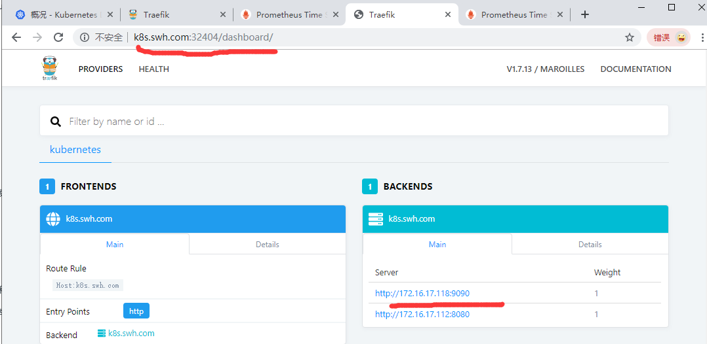
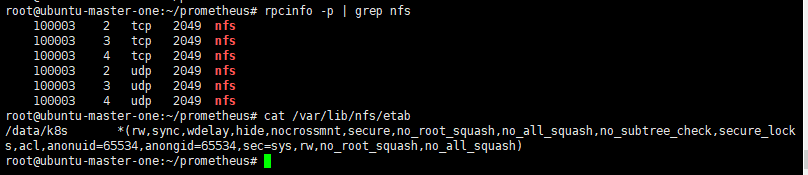

# prometheus 部署文档

- [安装](#安装)
    - [~~二进制方式~~](#~~二进制方式~~)
    - [kubernetes-Docker方式](#kubernetes-Docker方式)
- [NFS](#NFS)
    - [配置NFS](#配置NFS)
    - [使用示例](#使用示例)
- [StorageClass](#StorageClass)
    - [创建](#创建)
    - [](#)
    - [](#)


## 安装
完整的部署yaml可[参考](https://github.com/cnych/kubeapp/tree/master/prometheus)

### ~~二进制方式~~
安装只需要将二进制文件下载下来执行即可, [下载](https://prometheus.io/download/)对应版本.

Prometheus是通过[Yaml配置文件](prometheus.yml)启动的
```bash
./prometheus --config.file=prometheus.yml
```

### kubernetes-Docker方式

`为了方便管理, 我们将所有资源对象都安装在kube-ops的namespace下面`
```bash
# 创建kube-ops namespace
kubectl create namespace kube-ops
```

由于我们使用到了PV持久化存储, 测试环境下还需要使用[NFS](#NFS), 生产环境中推荐使用[ceph](../ceph/ceph.md)

- 为了方便的管理配置文件, 我们这里将prometheus.yml文件用ConfigMap的形式进行管理:
[prometheus-cm.yaml](prometheus-cm.yaml)
    ```bash
    # 暂时只配置了对prometheus的监控
    kubectl create -f prometheus-cm.yaml
    ```
- 为了将时间序列数据进行持久化, 我们将nfs共享数据目录和一个pvc对象进行了绑定, 所以我们需要提前创建好这个pvc对象,
[prometheus-volume.yaml](prometheus-volume.yaml)
    ```bash
    kubectl create -f prometheus-volume.yaml
    ```
- 配置rbac认证, 使用[prometheus-rbac.yaml](prometheus-rbac.yaml)
    ```bash
    kubectl create -f prometheus-rbac.yaml
    ```
- 如果有新的资源对象需要被监控, 只需将上面的ConfigMap对象更新即可, [prometheus-deploy](prometheus-deploy.yaml).
    ```bash
    # 部署时可能出现镜像无法拉取, 可换成国内镜像, 或者提前拉取镜像docker pull prom/prometheus
    kubectl create -f prometheus-deploy.yaml
    # 检查pod是否部署成功
    kubectl get pod -n kube-ops
    ```
    - 支持热更新, 当prometheus.yml配置文件变动时, 即会生效.
- Pod创建成功后, 为了能够在外部访问到prometheus的webUI服务, 我们还需创建一个service对象
    - 为了方便测试采用`NodePort`类型的服务, [prometheus-svc.yaml](prometheus-svc.yaml)
        ```bash
        kubectl create -f prometheus-svc.yaml
        # 查看svc创建是否成功
        kubectl get svc -n kube-ops
        ```
        - service创建成功后即可通过`http:任意节点ip:node端口`(http://192.168.80.137:31208)号访问prometheus的webUI服务了
            ```bash
            kubectl get svc -n kube-ops
            ```
    - 生产中推荐使用`Ingress`对象, 代理服务, [ingress.yaml](ingress.yaml)
        ```bash
        # 创建ingress代理
        kubectl create -f ingress.yaml
        # 查看创建是否成功, 也可登录后台`http://k8s.swh.com:32404`查看
        kubectl get Ingress -n kube-ops
        ```
        
        - 接下来通过`http://k8s.swh.node.com:31208`即可访问(在其他节点上访问NodePort服务)

## NFS

### 配置NFS
- 创建共享的数据目录`/data/k8s/`并设置权限
    ```bash
    chmod 755 /data/k8s/
    ```
- 安装`nfs-kernel-server`
    ```bash
    apt-get install -y nfs-kernel-server
    apt-get install -y rpcbind
    ```
    - 编辑`/etc/exports`添加下面一行
        ```bash
        # *: 表示任何人有权限连接; rw: 读写权限; sync: 文件同时写入硬盘和内存; 
        # root_squash: 将root用户及所属组都映射为匿名用户或用户组(默认设置)
        # no_root_squash: 与root_squash相反
        /data/k8s  *(rw,sync,no_root_squash)
        ```
- 启动服务:
    - 启动nfs服务需要向rpc注册, rpc 一旦重启, 注册文件都会丢失, 向他注册的文件都需要重启
        ```bash
        systemctl start rpcbind.service
        systemctl enable rpcbind
        systemctl status rpcbind
        ```
    - 重启nfs服务
        ```bash
        systemctl restart nfs-server
        systemctl enable  nfs-server
        systemctl status nfs-server
        # 确认nfs权限
        rpcinfo -p | grep nfs
        # 查看具体目录挂载权限
        cat /var/lib/nfs/etab
        ```
        
        
        
### 使用示例        
- 在k8s集群work node节点上安装nfs客户端
    ```bash
    # 安装
    apt-get install -y nfs-kernel-server
    apt-get install -y rpcbind
    # 启动
    systemctl start rpcbind.service
    systemctl enable rpcbind
    systemctl restart nfs-server
    systemctl enable  nfs-server
    ```
- 检查`k8s.swh.com`下nfs有共享目录
    ```bash
    showmount -e 192.168.80.135
    # 在客户端上新建目录
    mkdir -p /root/course/kubeadm/data
    # 将nfs共享目录挂载到客户端中创建的目录
    mount -t nfs 192.168.80.135:/data/k8s /root/course/kubeadm/data
    # 挂载成功后, 在客户端新建一个文件, 再去nfs服务端查看, 发现nfs服务端此时也有test.txt文件
    touch /root/course/kubeadm/data/test.txt
    ```
    
    

## StorageClass

由于静态PV并不能满足某些应用的需要, 比如`StatefulSet`类型的应用.  而动态PV就能满足, 接下来介绍的
StorageClass就是动态PV之一

### 创建
要使用StorageClass, 首先得安装对应的自动配置程序. 

这里以nfs为例, 需要一个Provisioner(一个nfs-client的自动配置程序), 这里使用我们已经配置好的
nfs服务器, 来自动创建持久卷, 也就是自动创建PV
    - 自动创建的PV以`${namespace}-${pvcName}-${pvName}`格式命名创建在NFS服务器上的共享数据目录当中
    - PV被回收后会以`archieved-${namespace}-${pvcName}-${pvName}`的格式存在NFS服务器上
    
安装nfs-client:
- 配置Deployment, [nfs-client.yaml](storageClass/nfs-client.yaml)
- 创建所需的`nfs-client-provisioner`的`serviceAccount`并榜上相应的权限
[nfs-client-sa.yaml](storageClass/nfs-client-sa.yaml)
    ```bash
    kubectl create -f nfs-client.yaml
    kubectl create -f nfs-client-sa.yaml
    ```

使用:
- 创建StorageClass对象示例, [nfs-client-class.yaml](storageClass/nfs-client-class.yaml):
    ```bash
    kubectl create -f nfs-client-class.yaml
    # 创建完成后查看示例部署情况
    kubectl get pod
    ```
- 测试下动态PV, 两种方法
    - 使用annotation属性标识[test-pvc.yaml](storageClass/test-pvc.yaml)
        ```bash
        kubectl apply -f test-pvc.yaml
        ```
        - 也可使用`volumeClaimTemplates`属性直接挂在至pod, 不单独创建成PVC对象, 示例
        [test-statefulset-nfs.yaml](storageClass/test-statefulset-nfs.yaml)
    - 更改k8s的默认存储后端为`course-nfs-storage`(不推荐)
        ```bash
        kubectl patch storageclass course-nfs-storage -p '{"metadata": {"annotations":{"storageclass.kubernetes.io/is-default-class":"true"}}}'
        ```
    